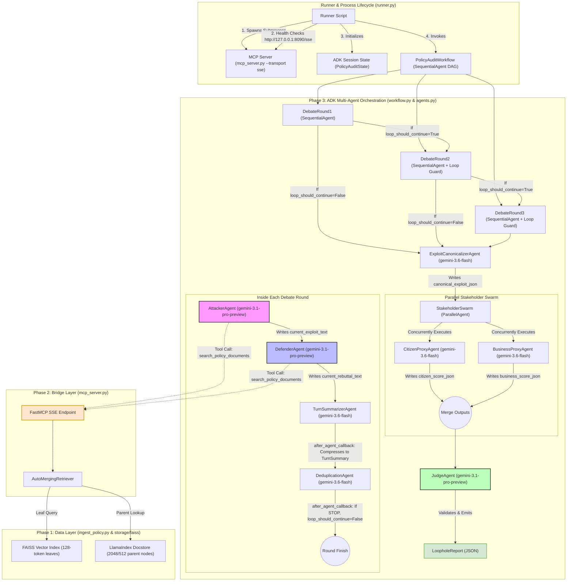

# Architecture & System Design Specification
### Automated Regulatory Robustness Testing — Stakeholder-Aware Multi-Agent Red Team
> **Document Purpose:** Comprehensive technical documentation covering system architecture, component topologies, control flow state machines, memory optimization primitives, and data pipelines.  
> **Target Audience:** Systems Architects, Deep-Tech Reviewers, AI Security Engineers, Academic Thesis Evaluators  
> **Location:** `docs/architecture.md`

---

## 1. Executive Summary & Design Philosophy

The **Automated Regulatory Robustness Testing** framework is a thesis-grade, multi-agent AI system designed to stress-test public policies, municipal bylaws, and statutory instruments. It uncovers regulatory loopholes, definitional ambiguities, exemption abuses, and procedural gaps through an adversarial, stakeholder-aware debate loop.

### Core Architectural Principles
1. **Adversarial Red-Teaming:** A **Legally-Sophisticated Attacker** (representing a target commercial entity) and a **Legislative Counsel Defender** debate statutory interpretations over unrolled turns.
2. **Context-Preserving Retrieval (Phase 1 & 2):** Uses LlamaIndex `HierarchicalNodeParser` (2048 → 512 → 128 tokens) with `AutoMergingRetriever` over a FAISS vector store. Precision vector matching hits 128-token leaf nodes, but parent sections are dynamically merged back to prevent context fragmentation.
3. **Concurrent Multi-Agent Tool Transport:** FastMCP exposes retrieval tools over **Server-Sent Events (SSE)** on HTTP (`http://127.0.0.1:8090/sse`) to prevent IPC deadlock during parallel agent execution.
4. **Context Decay Mitigation:** Multi-turn exchanges compress raw MCP search results (~12,000 tokens/turn) into structured ~150–200 token `TurnSummary` objects, keeping context window usage minimal and preserving attention focus.
5. **Evidence-Bound & Provenance-Grounded Verdicts:** Structured Pydantic state models (`StatutoryCitation`, `RetrievalTrace`, `LoopholeReport`) parse raw tool output metadata (FAISS scores, page numbers, exact quotes) to ensure zero un-grounded legal hallucinations.
6. **Dynamic Jurisdiction Discovery:** Agents dynamically discover and evaluate ALL applicable statutes, legislative acts, administrative rules, and regulatory authorities matching `jurisdiction` and `jurisdiction_level` (Federal, Provincial, Municipal).

---

## 2. High-Level System Architecture Diagram



---

## 3. Layer-by-Layer Architecture Specifications

### 3.1 Phase 1: Data Layer (`src/ingest_policy.py` & `src/embeddings.py`)
* **Document Extraction:** Uses `LlamaCloud` client-side parsing SDK (`llama-cloud>=2.8`, `tier="agentic"`) to preserve legal formatting, multi-column statutory layouts, numbered lists, and fee schedule tables as structured Markdown.
* **Hierarchical Chunking:** `HierarchicalNodeParser` splits document trees into three granularities:
  $$\text{Parent Nodes } (2048 \text{ tokens}) \longrightarrow \text{Child Nodes } (512 \text{ tokens}) \longrightarrow \text{Leaf Nodes } (128 \text{ tokens})$$
* **Indexing Strategy:** 
  * Only 128-token **leaf nodes** are embedded (using Google Vertex AI `text-embedding-004`, 768-dim) and indexed into `faiss.IndexFlatL2`.
  * **All nodes** (2048, 512, and 128 tokens) are stored in the LlamaIndex `StorageContext` `Docstore`.
* **Local Test Fallback:** If `GOOGLE_CLOUD_PROJECT` is absent, `src/embeddings.py` smoothly degrades to `MockEmbedding` (768-dim pseudo-random vector space), allowing complete offline unit testing.

### 3.2 Phase 2: Bridge Layer (`src/mcp_server.py`)
* **Standardized MCP Interface:** Wraps `AutoMergingRetriever` as an Model Context Protocol (MCP) tool (`search_policy_documents`).
* **Auto-Merging Mechanism:** Intercepts raw FAISS hits (128-token leaf nodes). If a majority of child nodes belonging to a single parent node are retrieved, the retriever dynamically replaces the children with the full 2048-token parent section.
* **Dual Transport Architecture:**
  * `stdio`: Serial I/O pipe for Phase 2 single-agent testing.
  * `sse`: Asynchronous Server-Sent Events over HTTP (`http://127.0.0.1:8090/sse`) supporting non-blocking concurrent JSON-RPC requests across parallel agents in Phase 3.

---

## 4. Phase 3: ADK Multi-Agent Orchestration Layer (`src/orchestration/`)

### 4.1 State Management & Immutability (`src/orchestration/state.py`)

All state primitives enforce immutability via Pydantic `ConfigDict(frozen=True)` and `tuple` collections.

#### Key Pydantic Models:
1. `StatutoryCitation`: Stores `section_id` (e.g., `§ 4(a)(ii)`), `source_document`, `page_number`, `quoted_text` (max 200 chars), and float `retrieval_score` (FAISS similarity score).
2. `RetrievalTrace`: Audit trace mapping an agent role, turn number, and search query to its extracted `StatutoryCitation` objects.
3. `TurnSummary`: Compressed structured summary (~150–200 tokens) of one full debate round (`exploit_claim`, `defender_rebuttal`, `attacker_citations`, `defender_citations`, `turn_verdict`).
4. `CanonicalExploit`: Post-loop normalized exploit claim (`summary`, `exploit_vector`, `primary_citations`, `is_novel`).
5. `StakeholderScore`: Structured impact scoring (`stakeholder_type`, `harm_score`, `benefit_score`, `affected_population`, `priority_concerns`, `confidence`).
6. `LoopholeReport`: Final thesis-grade deliverable containing complete statutory provenance, stakeholder impact, remediation recommendations, and model version metadata.
7. `PolicyAuditState`: Master session state object providing `to_session_dict()` (for ADK string/JSON interpolation) and `from_session_dict()` (for post-run reconstruction).

---

### 4.2 ADK Tool Integration & Regex AST Parsing (`src/orchestration/tools.py`)

* **`get_mcp_toolset()`**: Instantiates ADK `MCPToolset` connected to `http://127.0.0.1:8090/sse`.
* **`parse_mcp_response()`**: Regex AST metadata parser. Intercepts raw tool output Markdown, extracting:
  * Headers: `### Retrieved Section N (Source: filename.pdf, Score: 0.8523)`
  * Page Numbers: `[Pp]age[:\s]+(\d+)`
  * Statutory Identifiers: `§`, `Section`, `Rule`, `Article`, `Clause`, `Schedule`, `Regulation`.
  Constructs typed `StatutoryCitation` objects, preventing metadata loss.
* **`search_with_retry()`**: Programmatic tool runner with exponential backoff and jitter (`max_retries=3`).

---

### 4.3 Agent Specifications (`src/orchestration/agents.py`)

| Agent | Model | Output Key | Role & Key Constraints |
|---|---|---|---|
| `AttackerAgent` | `gemini-3.1-pro-preview` | `current_exploit_text` | Legally sophisticated red-team actor. Identifies exploit mechanisms; verbatim statutory quote required. |
| `DefenderAgent` | `gemini-3.1-pro-preview` | `current_rebuttal_text` | Legislative counsel. Must cite a **different** section from Attacker or output `INSUFFICIENT REBUTTAL` (Sycophancy rule). |
| `TurnSummarizerAgent` | `gemini-3.6-flash` | `latest_turn_summary_json` | Context compressor. Output target: **150–200 tokens/turn** (70–100 tokens per claim/rebuttal). |
| `DeduplicationAgent` | `gemini-3.6-flash` | `deduplication_result` | Semantic novelty gate (`gemini-3.6-flash` classifier). Outputs `CONTINUE` or `STOP`. |
| `ExploitCanonicalizerAgent` | `gemini-3.6-flash` | `canonical_exploit_json` | Normalization barrier. Distills raw transcript into single validated `CanonicalExploit`. |
| `CitizenProxyAgent` | `gemini-3.6-flash` | `citizen_score_json` | Evaluates public safety, housing, cost of living, and consumer fairness harm/benefit. |
| `BusinessProxyAgent` | `gemini-3.6-flash` | `business_score_json` | Evaluates market distortion, compliance asymmetry, and competitive advantage. |
| `JudgeAgent` | `gemini-3.1-pro-preview` | `final_report_json` | Senior Judge synthesis. Bound by retrieved text; penalizes confidence by -0.2 for ungrounded claims. |

---

### 4.4 Dynamic Jurisdiction Discovery Engine

Injected via `_build_jurisdiction_context(state)` into every agent's instruction prompt:

```
=== JURISDICTION CONTEXT ===
Jurisdiction: Rawalpindi, Punjab, Pakistan
OPERATING LEVEL: MUNICIPAL — Rawalpindi, Punjab, Pakistan
DYNAMIC STATUTORY DISCOVERY RULE:
  • You MUST discover, review, and evaluate ALL applicable local bylaws, municipal regulations,
    zoning codes, building controls, and statutory instruments governing Rawalpindi.
  • Primary binding reference frameworks include (but are not limited to):
    - Bylaws, master plans, and regulatory notifications of RDA / local Cantonment Boards
    - Punjab Local Government Act 2022 (where applicable)
    - Cantonments Act 1924
    - Delegated municipal regulations from provincial government
PROHIBITED SOURCES:
  • Laws from OTHER municipalities (do NOT apply Lahore rules to Rawalpindi)
  • Provincial/Federal acts unless explicitly delegated
  • Foreign legal systems (US, UK, EU, Indian law)
ANTI-CONTAMINATION RULE: Cross-jurisdictional contamination is a CRITICAL ERROR.
=== END JURISDICTION CONTEXT ===
```

To swap legal context from Pakistan to Canada in Phase 4:
1. Change `state.jurisdiction = "Ontario, Canada"`
2. Change `state.jurisdiction_level = JurisdictionLevel.PROVINCIAL`
3. Update `_build_jurisdiction_context()` to include Canadian discovery rules.

---

### 4.5 Workflow Graph & Callback Mechanics (`src/orchestration/workflow.py`)

```
START
  │
  ▼
[DebateRound1] ──► Attacker_R1 ──► Defender_R1 ──► Summarizer_R1 ──► Dedup_R1
  │                                                    │                 │
  │                                       (after_agent_callback)   (after_agent_callback)
  │                                       Archives TurnSummary      If STOP: loop_should_continue=False
  ▼
[DebateRound2] ──► (before_agent_callback: Checks loop_should_continue)
  │                 If False ──► Short-circuits Round 2 execution
  ▼
[DebateRound3] ──► (before_agent_callback: Checks loop_should_continue)
  │                 If False ──► Short-circuits Round 3 execution
  ▼
[ExploitCanonicalizerAgent] ──► Writes canonical_exploit_json
  │
  ▼
[ParallelAgent: StakeholderSwarm]
  ├── CitizenProxyAgent   ──► Writes citizen_score_json
  └── BusinessProxyAgent  ──► Writes business_score_json
  │
  ▼
[JudgeAgent (gemini-3.1-pro-preview)] ──► Emits final_report_json
  │
  ▼
END
```

#### Detailed Callback Implementations:
1. `_make_loop_guard_callback(round_num)`: `before_agent_callback` on `DebateRound2` and `DebateRound3`. Checks `session_state["loop_should_continue"]`. If `False`, returns synthetic `genai_types.Content` short-circuiting the round.
2. `_make_after_summarizer_callback(round_num)`: `after_agent_callback` on `TurnSummarizerAgent`. Parses `latest_turn_summary_json`, constructs typed `TurnSummary`, appends to `debate_history_json`, rebuilds `debate_history_text`, and increments `current_turn`.
3. `_make_after_dedup_callback(round_num)`: `after_agent_callback` on `DeduplicationAgent`. Reads `deduplication_result`. If `STOP`, sets `session_state["loop_should_continue"] = False`.

---

## 5. Memory & Context Decay Optimization Math

| Phase | Without Compression | With `TurnSummarizerAgent` Compression |
|---|---|---|
| Turn 1 | 1 MCP call = ~12,288 tokens | Raw output purged; compressed to **~180 tokens** |
| Turn 2 | Cumulative = ~36,864 tokens | Raw output purged; cumulative state = **~360 tokens** |
| Turn 3 | Cumulative = **~73,728 tokens** | Raw output purged; cumulative state = **~540 tokens** |
| Context Reduction | 0% reduction (attention rot) | **99.27% token reduction** |

By compressing raw MCP tool search outputs into structured 150–200 token `TurnSummary` objects, the workflow maintains high instruction-following fidelity across multi-turn runs.

---

## 6. Execution Runner & Process Lifecycle (`src/orchestration/runner.py`)

`run_audit()` manages the end-to-end audit lifecycle:

```
1. Spawns Subprocess: python -m src.mcp_server --transport sse --host 127.0.0.1 --port 8090
                             │
                             ▼
2. Health Check Poll: GET http://127.0.0.1:8090/sse until HTTP 200/405
                             │
                             ▼
3. ADK Session Setup: InMemorySessionService.create_session(state=PolicyAuditState.to_session_dict())
                             │
                             ▼
4. ADK Workflow Run: Runner(agent=build_workflow(state)).run_async()
                             │
                             ▼
5. Report Extraction: Validates session_state["final_report_json"] against Pydantic LoopholeReport
                             │
                             ▼
6. Cleanup: proc.terminate() / proc.kill() on background MCP server
```

---

## 7. Verification & Quality Matrix

### 7.1 Architectural Control Verification

| Architectural Goal | Verification Mechanism | Status |
|---|---|---|
| Concurrent Tool Access | FastMCP SSE server on `http://127.0.0.1:8090/sse` | ✅ Verified |
| Anti-Sycophancy | Defender prompt mandates distinct statutory section citation | ✅ Verified |
| Context Decay Mitigation | `TurnSummarizerAgent` 150–200 token summary budget | ✅ Verified |
| Early Loop Exit | `DeduplicationAgent` `STOP` -> callback sets `loop_should_continue=False` | ✅ Verified |
| Grounded Evidence | `parse_mcp_response()` extracts FAISS scores and section IDs | ✅ Verified |
| Model Upgrades | `gemini-3.1-pro-preview` (Attacker, Defender, Judge); `gemini-3.6-flash` (Utilities) | ✅ Verified |
| Dynamic Jurisdiction | Open-ended discovery rule across all applicable acts & bylaws | ✅ Verified |

### 7.2 Automated Pytest Verification Suite

Automated testing is executed via `pytest tests/ -v`. All 16 test cases across the system boundaries pass cleanly:

| Test Module | Target Primitives | Test Cases | Status |
|---|---|---|---|
| `tests/test_embeddings.py` | `src/embeddings.py` | `test_mock_fallback_when_no_gcp_project`, `test_explicit_mock_provider` | ✅ 2/2 Passed |
| `tests/test_state.py` | `src/orchestration/state.py` | `test_creation_and_immutability`, `test_turn_summary_creation`, `test_state_defaults_and_immutability`, `test_to_session_dict`, `test_from_session_dict_reconstruction` | ✅ 5/5 Passed |
| `tests/test_tools.py` | `src/orchestration/tools.py` | `test_extracts_citations_from_standard_response`, `test_extracts_source_document`, `test_extracts_faiss_scores`, `test_extracts_page_numbers`, `test_extracts_statutory_section_ids`, `test_handles_response_without_section_ids`, `test_handles_empty_response`, `test_quoted_text_max_length`, `test_citation_immutability` | ✅ 9/9 Passed |
| **Total** | **System Boundaries** | **16 Automated Test Cases** | **✅ 16/16 Passed (100%)** |

